**Reciipiie - An App for Food Recipes**<br>

[Watch App Overview Video](https://drive.google.com/file/d/1tL5RVgOxrwZm0AQrnSOCvoo4BfZsuRTJ/view?usp=sharing)<br/>

[Download APK](https://drive.google.com/file/d/1ksjkBQi3oq3xb4sszgLsysogqTQWfPOB/view?usp=sharing)

## Overview

Developed a recipe app with Google One Tap Sign-In, favorites, search with pagination, dark/light mode, and comprehensive recipe details. Designed to enhance user experience and efficient browsing.
## App Screenshots In Dark Mode


<p align="center">
  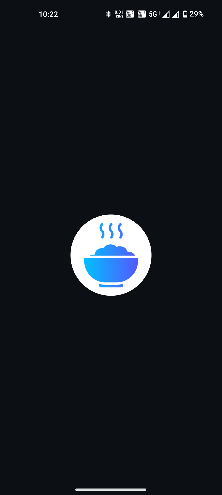&nbsp;&nbsp;&nbsp;
  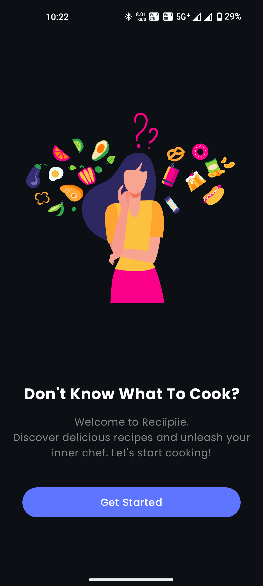&nbsp;&nbsp;&nbsp;
  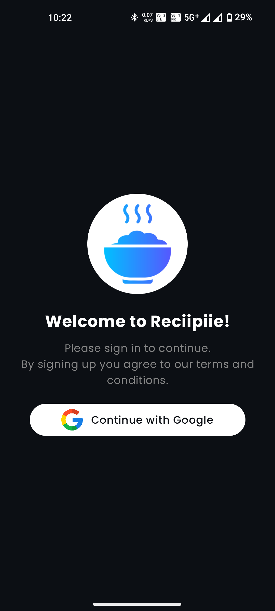&nbsp;&nbsp;&nbsp;
  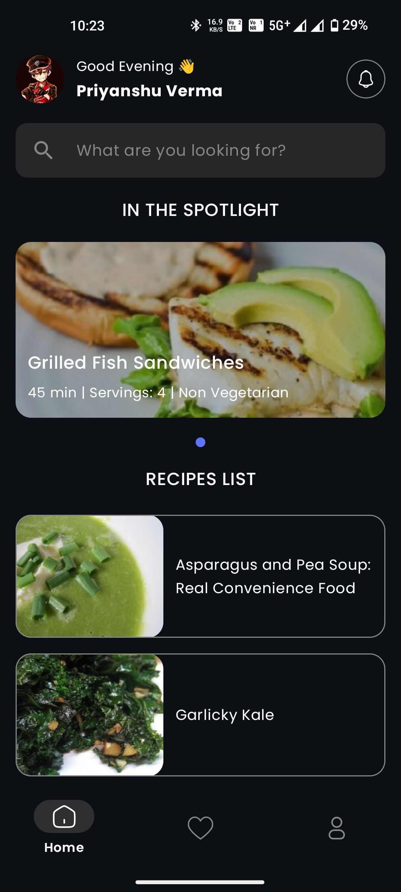&nbsp;&nbsp;&nbsp;
  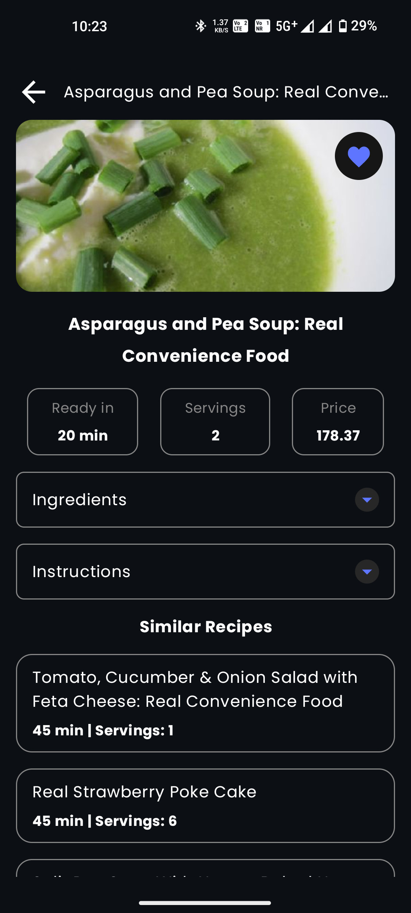&nbsp;&nbsp;&nbsp;
  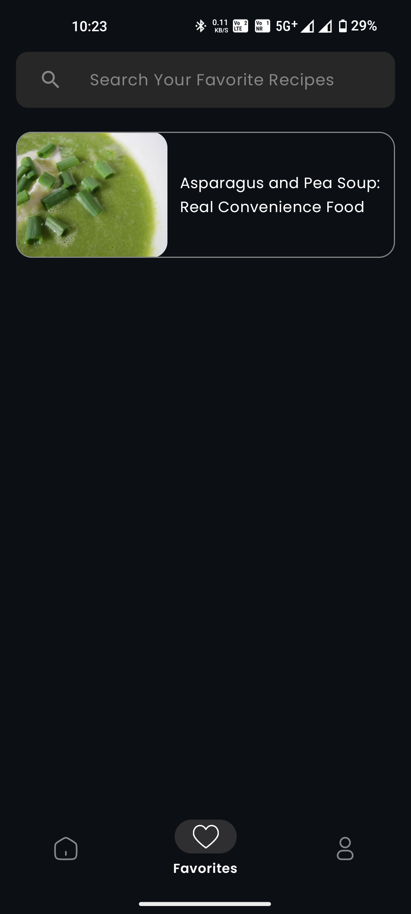&nbsp;&nbsp;&nbsp;
  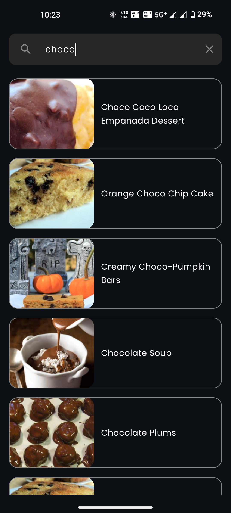&nbsp;&nbsp;&nbsp;
  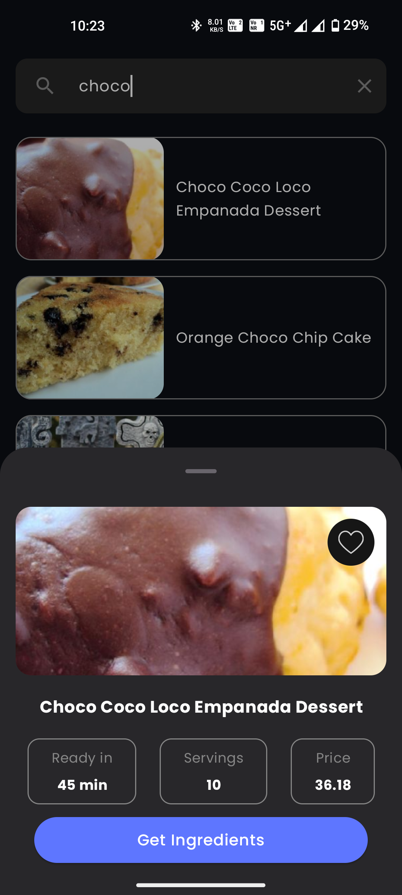&nbsp;&nbsp;&nbsp;
  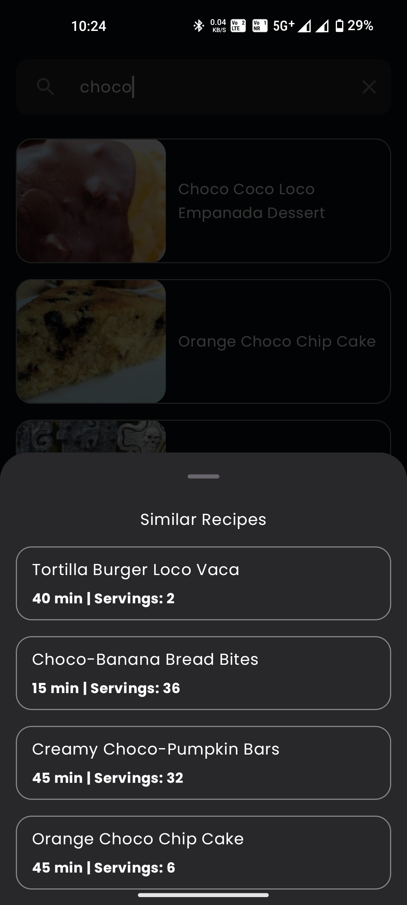&nbsp;&nbsp;&nbsp;
  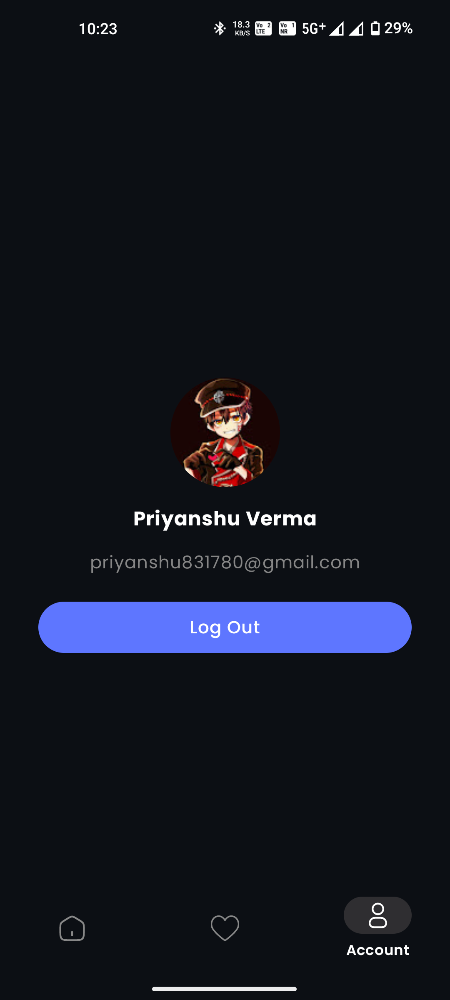&nbsp;&nbsp;&nbsp;
</p>

## App Screenshots In Light Mode


<p align="center">
  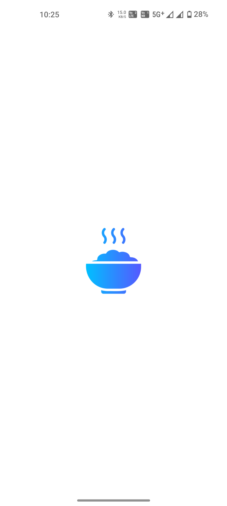&nbsp;&nbsp;&nbsp;
  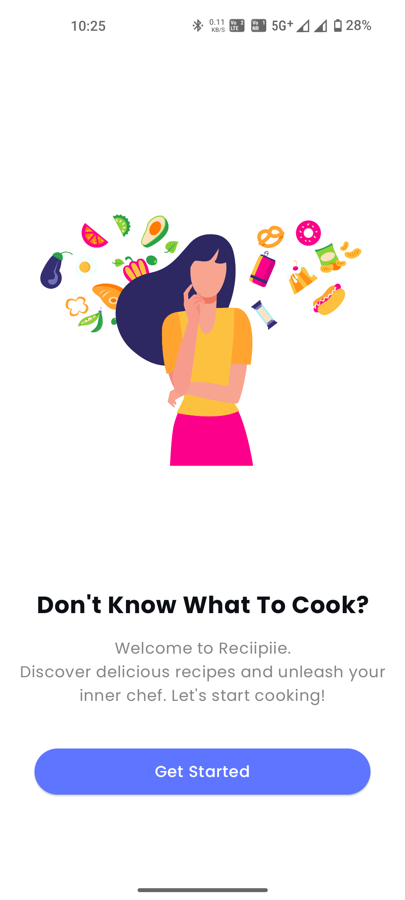&nbsp;&nbsp;&nbsp;
  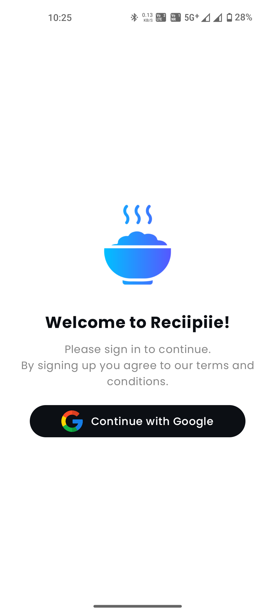&nbsp;&nbsp;&nbsp;
  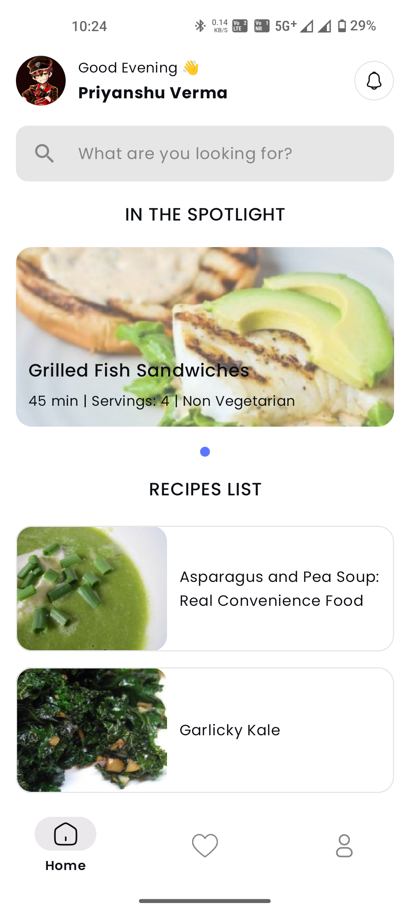&nbsp;&nbsp;&nbsp;
  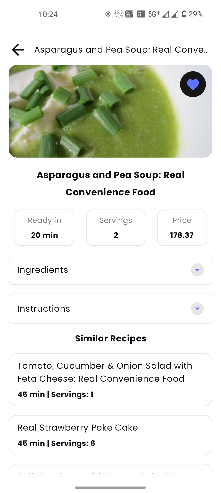&nbsp;&nbsp;&nbsp;
  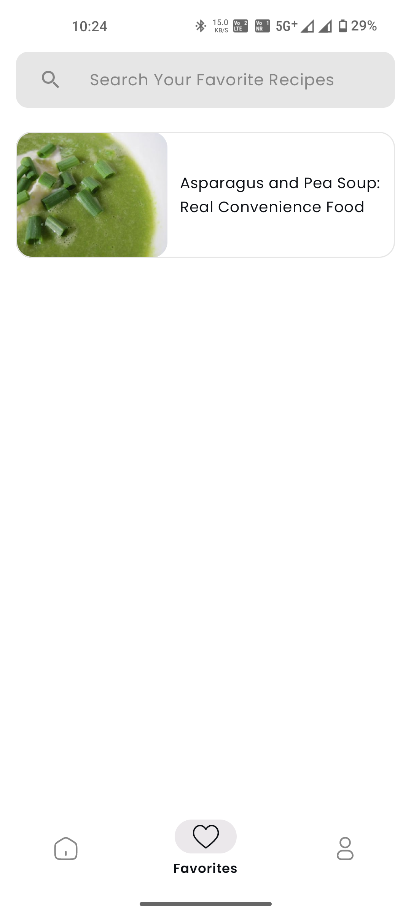&nbsp;&nbsp;&nbsp;
  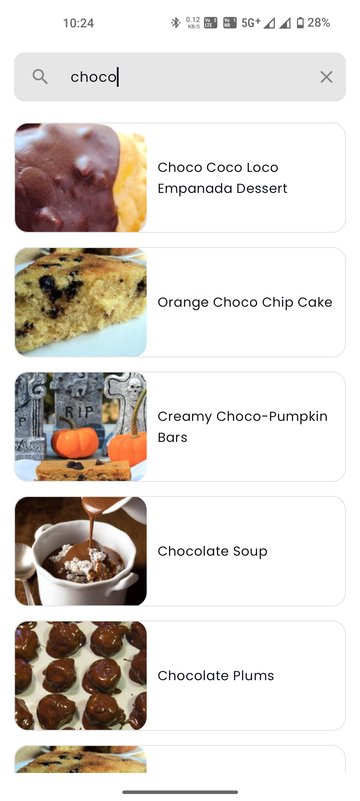&nbsp;&nbsp;&nbsp;
  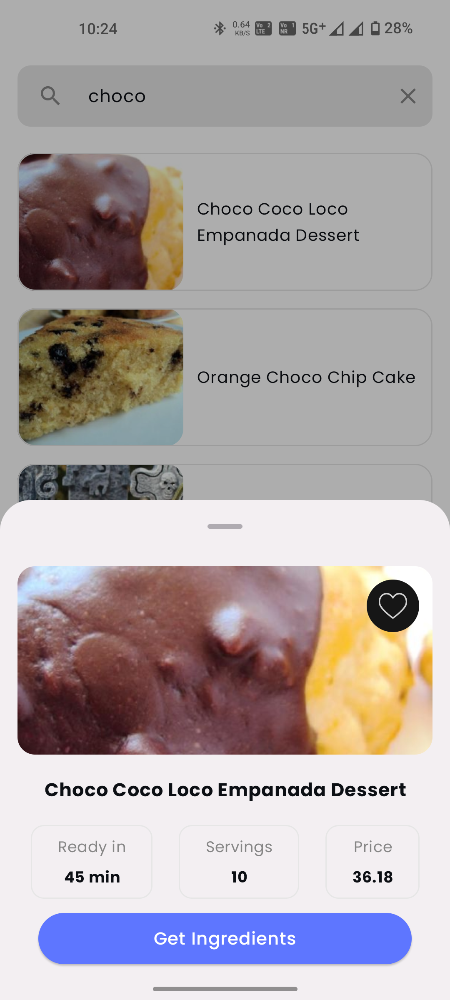&nbsp;&nbsp;&nbsp;
  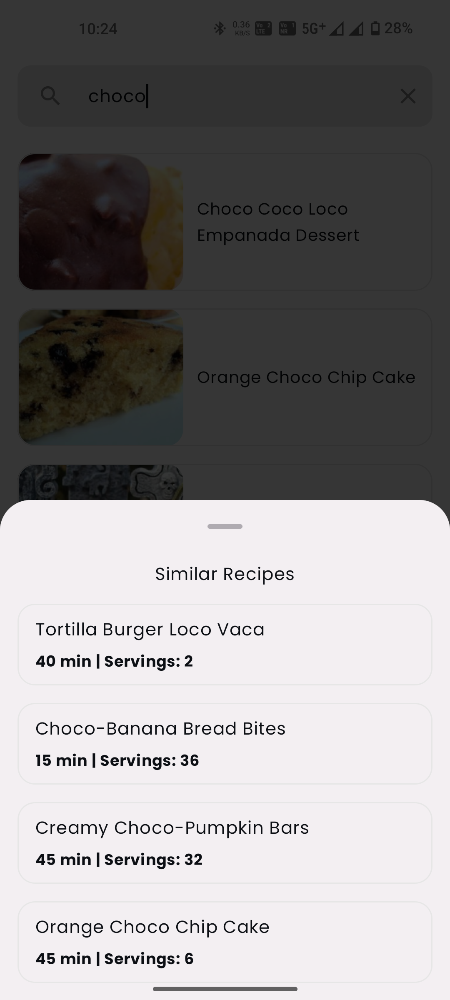&nbsp;&nbsp;&nbsp;
  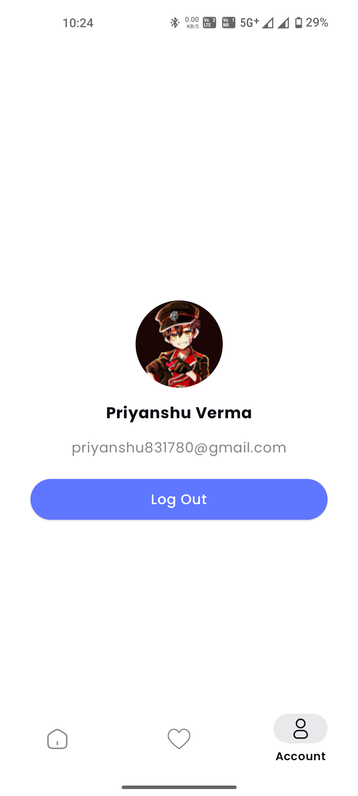&nbsp;&nbsp;&nbsp;
</p>


## Features

### Google One Tap SignIn
- User can sign in or sign up easily in the app with google one tap sign in.

### Recipie List With Pagination
- View all recipie list at one place.

### Recipie Search With Pagination.
- Powerful search functionality to find any recipie.

### Recipie Overview
- View detailed ingredients of any recipie with pictures.
- View detailed instructions of the recipie.
- View simillar recipies in the recipie overview.

### Favorites
- Create and manage a personalized list of recipies you want to save.

### Dark Mode and Light Mode
- Toggle between dark mode and light mode to suit your preferences

### Handling Loading/Error/Empty States

The app handles loading, error, and empty states for all cases to ensure a smooth user experience.

### Folder Structure

The app follows a standard, well-defined folder structure to maintain clean and maintainable code.

## Third Party Library Used
- Lottie Files
- Coil

## Getting Started

### Prerequisites
- Android Studio
- An Android device or emulator running Android 5.0 (Lollipop) or higher

### Installation

1. Clone the repository:
    ```bash
    git clone https://github.com/phinion8/StockInfo
    ```

2. Open the project in Android Studio.

3. Build and run the app on your device or emulator.


